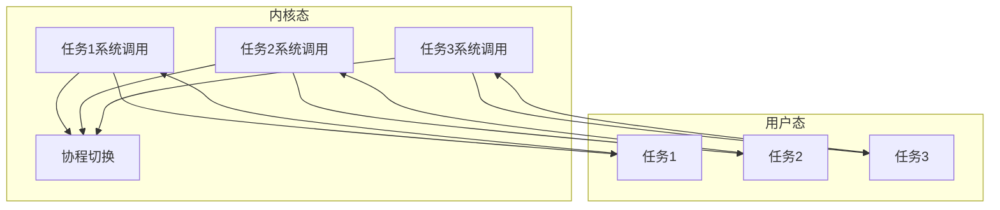

# 思路整理

异步操作系统的目的是在发生I/O时或者出现空闲时进行处理其他应用程序，以充分利用处理器资源。因此能否在内核中实现类似C++20的协程，能够对系统调用进行中断处理，在系统中断中发生I/O操作时进行挂起，优先处理其他的进程。

将内核中的系统调用与线程统一起来，每一个线程不仅拥有用户态的部分，同时也发生在内核态，内核中的协程只对在用户程序处于内核态时进行切换。当任务时间片耗尽时需要切换同样也是发生了时钟中断，进入到内核态的中断后发生切换。（以上描述可能存在误差，有些地方描述的不太合适）

